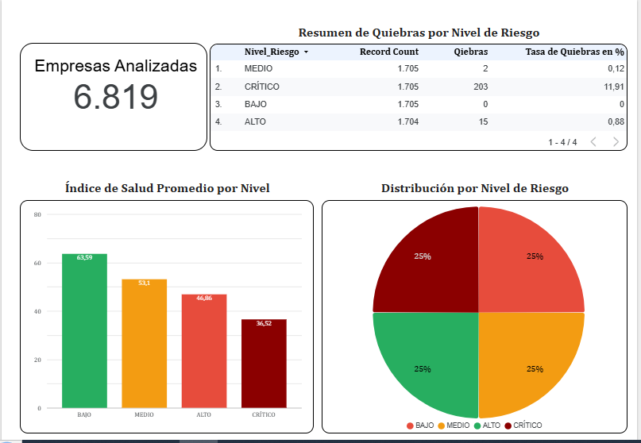
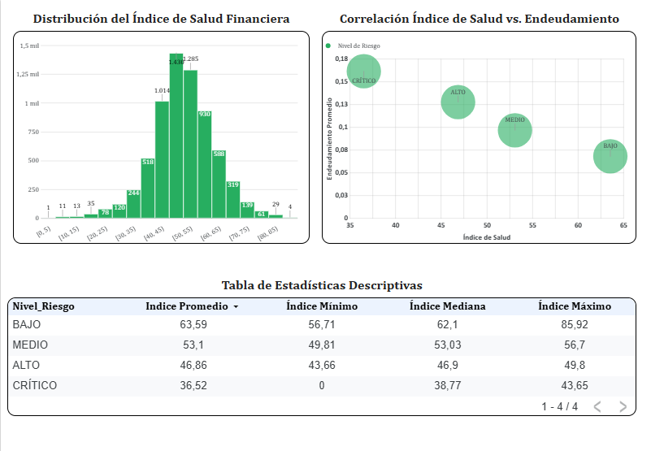
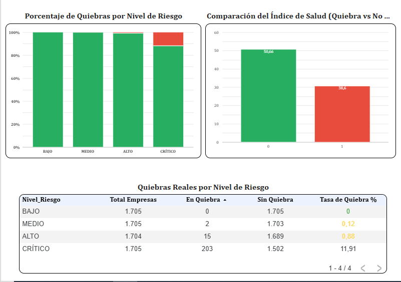

#  Taiwan Bankruptcy Prediction: End-to-End Data Pipeline & Risk Intelligence

**Autor:** Rafael Aguayo  
**Fecha:** Julio 2026  
**Estado:** ✅ Completado y Desplegado  

##  Resumen Ejecutivo
Este proyecto implementa un pipeline de datos **End-to-End** para predecir y clasificar el riesgo de quiebra empresarial. Partiendo de un dataset crudo de 96 variables financieras, se diseñó una arquitectura robusta que transforma los datos, genera un **Índice de Salud Financiera (0-100)** y los visualiza en un dashboard ejecutivo de **Data Studio**. 

El modelo final logró concentrar al **92.2% de las quiebras históricas** dentro del segmento de "Riesgo Crítico" (25% de la población), alcanzando un **AUC de 0.9266** mediante un enfoque de ingeniería de características y reglas de negocio, sin necesidad de modelos de Machine Learning complejos.

---

## 🛠️ Stack Tecnológico
*   **Lenguaje & Librerías:** Python, Pandas, NumPy, Scikit-Learn, SciPy, Seaborn, Matplotlib.
*   **Cloud Data Warehouse:** Google BigQuery.
*   **Compute & Orchestration:** Google Colab.
*   **Business Intelligence:** Google Data Studio.
*   **Formatos de Datos:** CSV, Parquet (Checkpoint).

## 📂 Recursos y Datos

📁 **Carpeta de Google Drive con los notebooks y datos:**  
👉 [Taiwan Bankruptcy Project - Google Drive](PEGAR_AQUI_TU_LINK_DE_DRIVE)

*Incluye:*
- `data.csv` (dataset original)
- `datos_analisis_final.parquet` (datos transformados)
- Notebooks: `01_EDA`, `02_ETL_Pipeline`, `03_Validacion`

---

## 🏗️ Arquitectura del Pipeline

```text
[Google Drive: data.csv] 
       │
       ▼ (Fase 1: Limpieza de Esquema con Regex)
[BigQuery: datos_crudos] ─(Extracción vía API oficial)──┐
       │                                                 │
       ▼ (Fase 2: Transformación en Colab)               │
[Google Colab: Pandas/Scikit-Learn]                      │
       ├─► Filtrado de dimensionalidad (96 → 10 vars)    │
       ├─► Escalado Robusto (RobustScaler + Clipping)    │
       ├─► Inversión lógica de variables negativas       │
       ─► Clasificación dinámica por percentiles        │
       │                                                 │
       ▼ (Checkpoint de Calidad en Parquet)              │
[Google Drive: datos_analisis_final.parquet]             │
       │                                                 │
       ▼ (Fase 3: Carga Idempotente con WRITE_TRUNCATE)  │
[BigQuery: datos_analisis_final] ◄───────────────────────
       │
       ▼
[Data Studio: Dashboard de Inteligencia de Riesgo]


## 📈 Fase 4: Inteligencia de Negocios (Data Studio)





